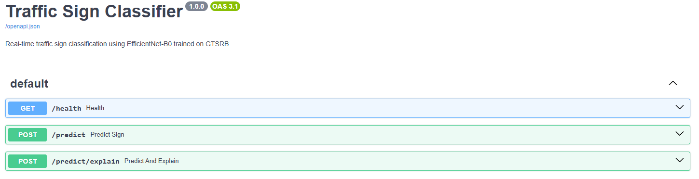
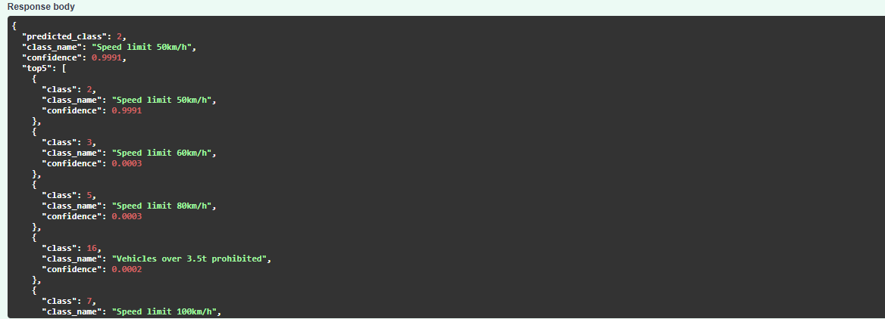
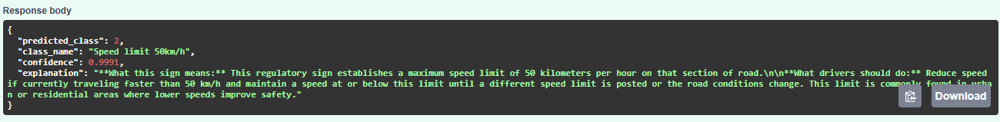

# Traffic Sign Classifier API

Real-time traffic sign classification using EfficientNet-B0 fine-tuned on GTSRB (95.5% accuracy), served as a REST API with Claude-powered plain-English explanations, containerised with Docker and deployed on Azure Container Apps.

**Live API:** https://traffic-sign-classifier.bluecliff-4a403997.westeurope.azurecontainerapps.io/docs

---

## Overview

This project fine-tunes a pre-trained EfficientNet-B0 on the German Traffic Sign Recognition Benchmark (GTSRB), achieving **95.5% test accuracy** across 43 classes. The model is served via a FastAPI REST API with two endpoints: one for classification and one that integrates the Anthropic Claude API to generate plain-English driving instructions per detected sign.

The full stack covers model training, API development, containerisation with Docker, automated CI/CD via GitHub Actions, and cloud deployment on Azure Container Apps — providing an end-to-end MLOps pipeline from model weights to a publicly accessible URL.

---

## Tech Stack

| Component | Technology |
|---|---|
| Model | EfficientNet-B0 (PyTorch) |
| Dataset | GTSRB — 43 classes, 39,270 images |
| API | FastAPI |
| GenAI | Anthropic Claude API |
| Containerisation | Docker |
| Registry | Azure Container Registry |
| Deploy | Azure Container Apps |
| CI/CD | GitHub Actions |

---

## Architecture

```
Image Input (JPEG/PNG)
        ↓
FastAPI REST API
        ↓
EfficientNet-B0 (PyTorch) — fine-tuned on GTSRB, 43 classes
        ↓
/predict         →  class + confidence + top-5 predictions
/predict/explain →  class + confidence + Claude API explanation
        ↓
Docker → Azure Container Registry → Azure Container Apps
        ↑
GitHub Actions CI/CD — auto-deploys on every git push
```

---

## API Endpoints

### `GET /health`
Returns API status. Used by Azure for health checks.

### `POST /predict`
Classifies a traffic sign image and returns the predicted class, confidence score, and top-5 predictions.

**Input:** JPEG or PNG image

**Response:**
```json
{
  "predicted_class": 2,
  "class_name": "Speed limit 50km/h",
  "confidence": 0.9991,
  "top5": [
    {"class": 2, "class_name": "Speed limit 50km/h", "confidence": 0.9991},
    {"class": 3, "class_name": "Speed limit 60km/h", "confidence": 0.0003},
    {"class": 5, "class_name": "Speed limit 80km/h", "confidence": 0.0003}
  ]
}
```

### `POST /predict/explain`
Classifies the image and calls the Claude API to generate a plain-English explanation of what the sign means and what a driver should do.

**Response:**
```json
{
  "predicted_class": 2,
  "class_name": "Speed limit 50km/h",
  "confidence": 0.9991,
  "explanation": "This is a Speed Limit 50 km/h sign. Drivers must reduce their speed to no more than 50 km/h and maintain that limit until they encounter a sign indicating a different speed restriction."
}
```

---

## Screenshots

### API Documentation


### Classification Result


### Explanation Result (Claude API)


---

## Model Performance

| Metric | Value |
|---|---|
| Test Accuracy | 95.5% |
| Architecture | EfficientNet-B0 (transfer learning from ImageNet) |
| Dataset | GTSRB (German Traffic Sign Recognition Benchmark) |
| Classes | 43 |
| Train samples | 26,640 |
| Test samples | 12,630 |
| Epochs | 10 |
| Batch size | 64 |
| Optimiser | Adam (lr=1e-3) |
| Loss function | CrossEntropyLoss |

---

## Local Setup

```bash
# Clone the repository
git clone https://github.com/Augusto-98/traffic-sign-classifier.git
cd traffic-sign-classifier

# Create virtual environment
python -m venv venv
venv\Scripts\activate  # Windows

# Install dependencies
pip install -r requirements.txt

# Add your Anthropic API key
echo ANTHROPIC_API_KEY=your_key_here > .env

# Run the API
uvicorn app.main:app --reload
```

The API will be available at `http://127.0.0.1:8000/docs`.

---

## Docker

```bash
docker build -t traffic-sign-classifier .
docker run -p 8000:8000 -e ANTHROPIC_API_KEY=your_key_here traffic-sign-classifier
```

---

## CI/CD Pipeline

Every push to `main` triggers a GitHub Actions workflow that automatically:

1. Authenticates with Azure and the Container Registry
2. Builds the Docker image
3. Pushes the image to Azure Container Registry
4. Deploys the updated container to Azure Container Apps

A `git push` is sufficient to update the production API — no manual Azure interaction required.

---

## Project Structure

```
traffic-sign-classifier/
├── app/
│   ├── main.py                   # FastAPI endpoints
│   ├── model.py                  # EfficientNet-B0 inference logic
│   └── schemas.py                # Pydantic request/response models
├── model_weights/
│   └── efficientnet_gtsrb.pt     # Trained model weights
├── images/                       # README screenshots
├── .github/workflows/
│   └── ci-cd.yml                 # GitHub Actions pipeline
├── Dockerfile
├── requirements.txt
└── train.py                      # Model training script
```

---

## Author

Augusto Fernandes — [github.com/Augusto-98](https://github.com/Augusto-98)
